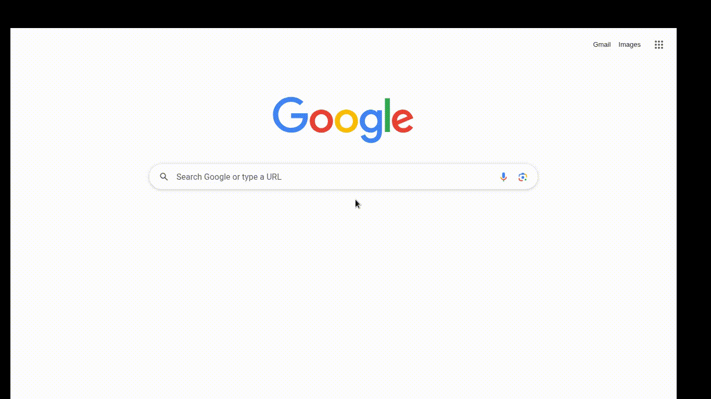

# Google Meet

## Швидкий старт
```bash
# Клонувати репозиторій
git clone <repo-url>
cd meet-recorder

# Налаштувати .env
cp .env.example .env
# Вказати INVITE_LINK та інші параметри

# Запустити
docker-compose up --build
```

## Як працює

1. Бот підключається до Meet за посиланням
2. Вимикає камеру/мікрофон (опціонально)
3. Чекає на підтвердження входу від хоста
4. Записує відео+аудіо в `/STORAGE_DIR` 
5. Конвертує з `.mkv` в `.mp4` після завершення

## Структура
```
├── main.py      # Точка входу
├── start.sh     # Docker start script
├── config.py   # Конфігурація
├── /services       
│   ├── google_meet.py   # Автоматизація Meet
│   ├── recorder.py      # FFmpeg wrapper
│   └── storage.py       # Збереження файлів
```

## Примітки

- Записи зберігаються локально
- Бот чекає підтвердження входу від організатора і 
- При `HEADLESS=true` відео не буде працювати лише аудіо

